# Oopsie 10.10.10.28 - HackTheBox - Starting Point

Notes from the Oopsie box, HackTheBox Starting Point, 18/05/2021.

# Enumeration

## Nmap scan

```
PORT   STATE SERVICE VERSION
22/tcp open  ssh     OpenSSH 7.6p1 Ubuntu 4ubuntu0.3 (Ubuntu Linux; protocol 2.0)
| ssh-hostkey:
|   2048 61:e4:3f:d4:1e:e2:b2:f1:0d:3c:ed:36:28:36:67:c7 (RSA)
|   256 24:1d:a4:17:d4:e3:2a:9c:90:5c:30:58:8f:60:77:8d (ECDSA)
|_  256 78:03:0e:b4:a1:af:e5:c2:f9:8d:29:05:3e:29:c9:f2 (ED25519)
80/tcp open  http    Apache httpd 2.4.29 ((Ubuntu))
| http-methods:
|_  Supported Methods: GET HEAD POST OPTIONS
|_http-server-header: Apache/2.4.29 (Ubuntu)
|_http-title: Welcome
Service Info: OS: Linux; CPE: cpe:/o:linux:linux_kernel
```

## Website 10.10.10.28

Overview


-None of the links work.

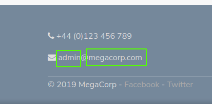

Possible user "admin".
Possible domain "megacorp.com". < added to /etc/hosts.

## Gobuster | directory-list-2.3-medium.txt

```
===============================================================
Gobuster v3.1.0
by OJ Reeves (@TheColonial) & Christian Mehlmauer (@firefart)
===============================================================
[+] Url:                     http://10.10.10.28
[+] Method:                  GET
[+] Threads:                 30
[+] Wordlist:                /usr/share/dirbuster/directory-list-2.3-medium.txt
[+] Negative Status codes:   404
[+] User Agent:              gobuster/3.1.0
[+] Timeout:                 10s
===============================================================
2021/05/17 19:29:16 Starting gobuster in directory enumeration mode
===============================================================
/images               (Status: 301) [Size: 311] [--> http://10.10.10.28/images/]
/themes               (Status: 301) [Size: 311] [--> http://10.10.10.28/themes/]
/uploads              (Status: 301) [Size: 312] [--> http://10.10.10.28/uploads/]
/css                  (Status: 301) [Size: 308] [--> http://10.10.10.28/css/]
/js                   (Status: 301) [Size: 307] [--> http://10.10.10.28/js/]
/fonts                (Status: 301) [Size: 310] [--> http://10.10.10.28/fonts/]
/server-status        (Status: 403) [Size: 276]

===============================================================
2021/05/17 19:39:31 Finished
===============================================================
```

Found the directory "/cdn-cgi/login" looking at the source code.

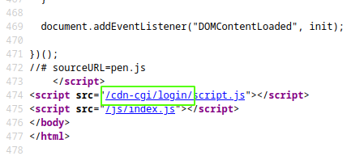

## /cdn-cgi/login/

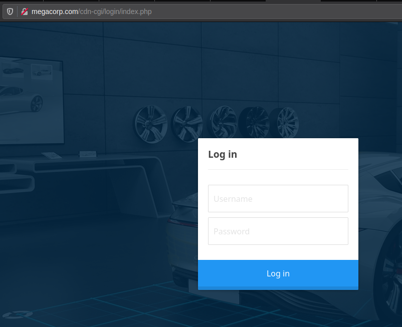

We can log in with the user "admin" and password "MEGACORP_4dm1n!!" (same password from last box Archetype).

## admin.php

Overview.

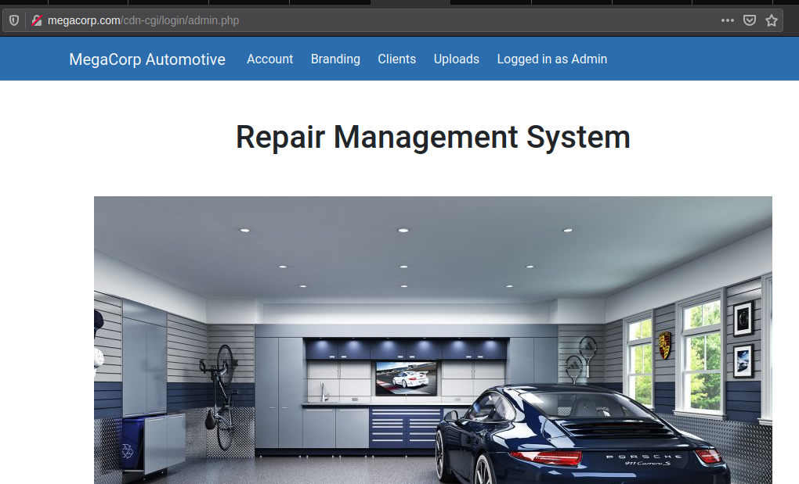

In the admin page we can access Account, Branding and CLients tabs. To access Uploads we need super admin rights.

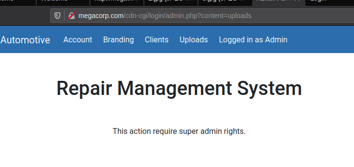

# Getting access

Its possible to manipulate the value "id" in the url and check other users. Access ID identifies the user logged in. By changing the value of the cookie "User" with the value of another user Access ID it is possible to use his account.

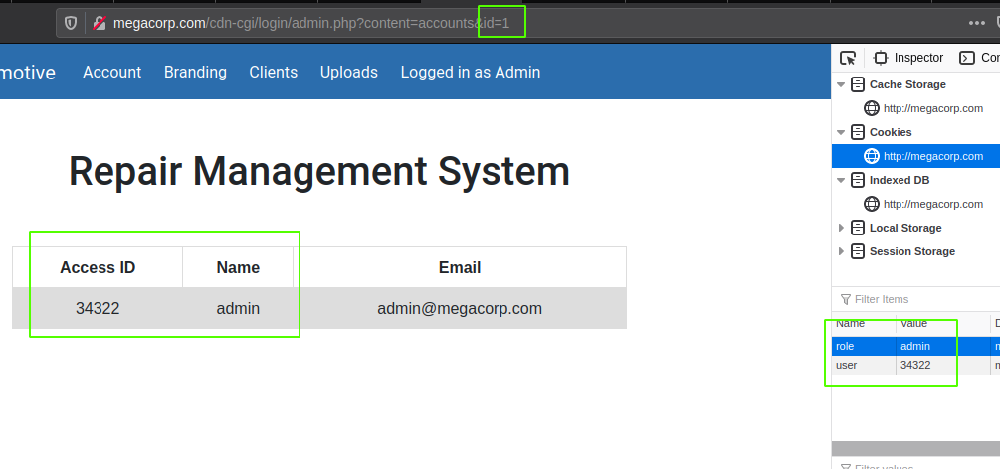

Since not all user ids are valid with the following python script it is possible to check which ones are empty based on the size of the response.

## test.py

```py
import requests
cookie = dict(user='34322')
url = "http://megacorp.com/cdn-cgi/login/admin.php?content=accounts&id="
for i in range(0, 100):
    r = requests.get(url+str(i), cookies=cookie)
    print("id: " + str(i) + " " + str(len(r.content)))
```

Here is some of the output.

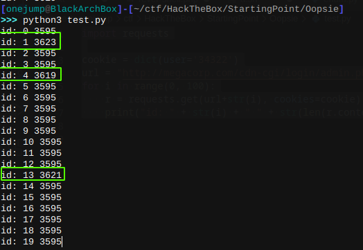

Everything different than 3595 is a valid user id, after checking I found Super admin at id=30. Changed value of the cookie user, now I'm super admin.

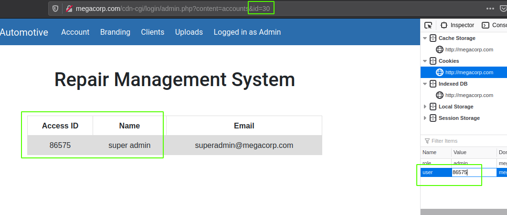

After that it is possible to upload a php reverse shell. [PentestMonkeyPHPRevShell](https://github.com/pentestmonkey/php-reverse-shell/blob/master/php-reverse-shell.php)

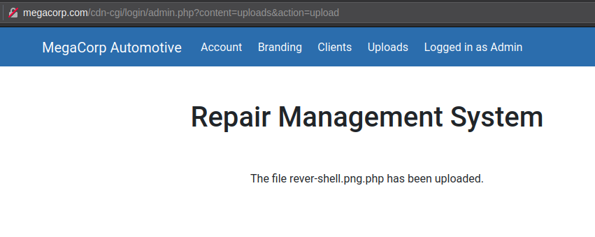

Navigate to http://megacorp.com/uploads/rever-shell.png.php and receive a shell.

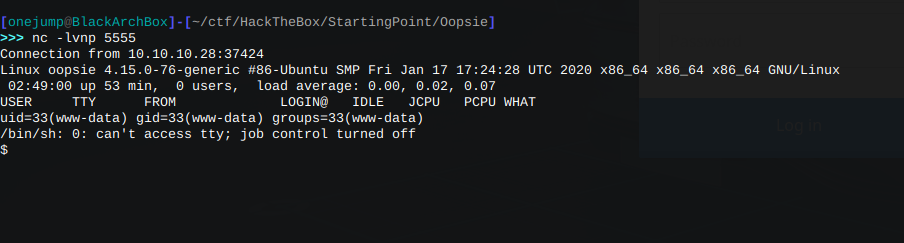

Flag user.txt at /home/robert/user.txt

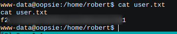

# Privilege escalation

## robert

In the home directory of www-data (/var/www), in /html/cdn-cgi/login there is a "db.php" file, robert's credentials are in this file.

.png)

## root

Searching for SUID binaries I found "bugtracker".

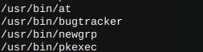

All this does is cat a file from "/root/reports".

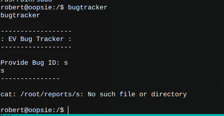

Using "../root.txt" as input we can get the root flag.

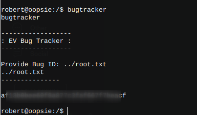

Using ltrace on the binary we can see that it calls "cat" not using the full path. By creating another "cat" binary that will spawn a shell and putting the directory in PATH it is possible to obtain a shell as root.

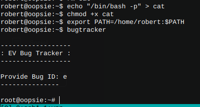

# Extra

In the .config folder in the root directory there is a "filezila.xml" file with credentials for ftp in the host 10.10.10.46 (next machine in StartingPoint).

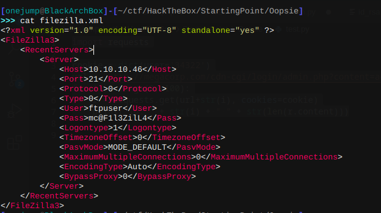

# Credentials.

## Website
admin:MEGACORP_4dm1n!!

## Linux user
robert:M3g4C0rpUs3r!

## Ftp at 10.10.10.46
ftpuser:mc@F1l3ZilL4
